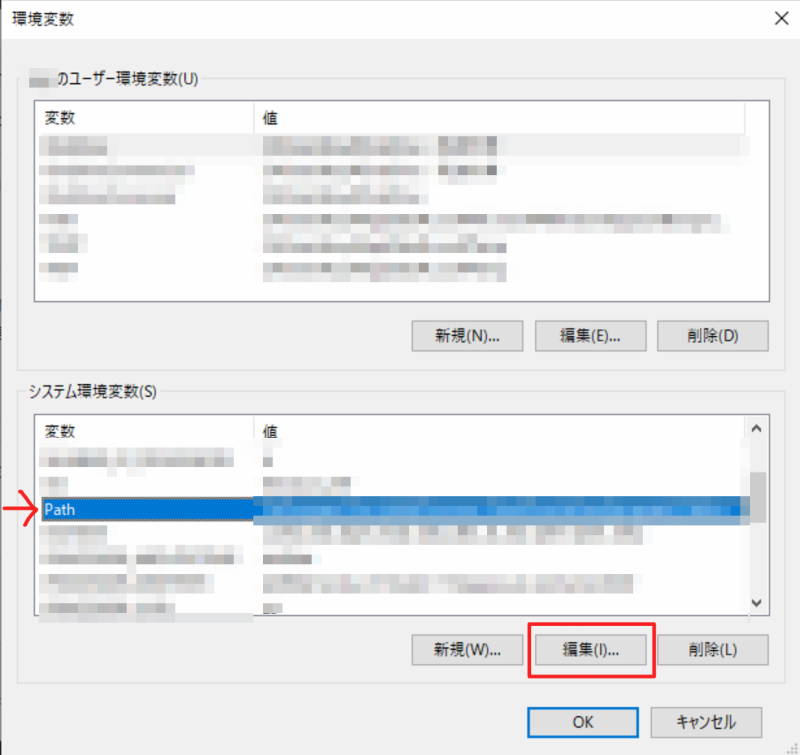
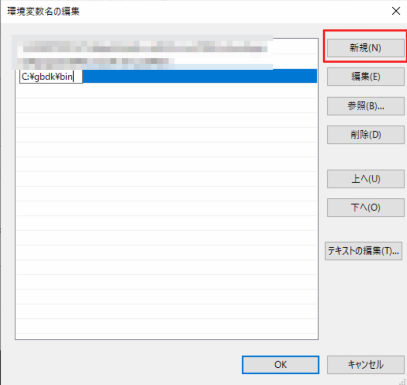
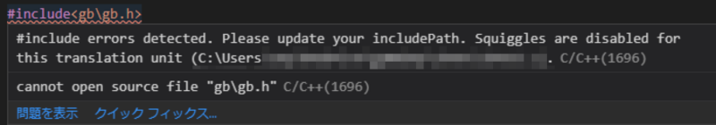
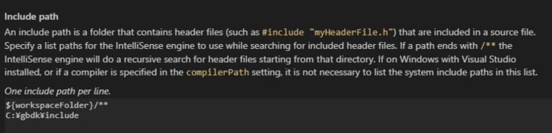
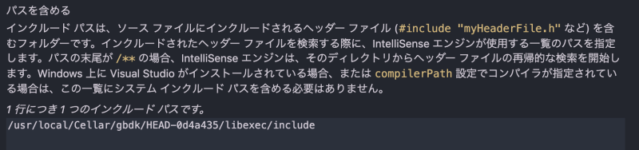

## \#0 はじめに

[GBDK](http://gbdk.sourceforge.net/)は、C 言語を用いてゲームボーイのソフトを制作することができるツールです。今回は、この GBDK の導入方法を解説していきます。

## \#1 Windows

以下のページより、GBDK の最新版をダウンロードします。

[https://sourceforge.net/projects/gbdk/files/latest/download](https://sourceforge.net/projects/gbdk/files/latest/download)

展開すると「gbdk」というフォルダが出てくるので、これを C ドライブ直下に配置してください（C ドライブ直下でないとうまく動かないようです）。

次に、環境変数を設定します。

- コントロールパネル → システム を開くか、Win+Pause/Break を押す
- 左にある「システムの詳細設定」を押す
- 下にある「環境変数(N)...」を押す

ここまで進めると、このような画面が出ます。



下の「システム環境変数」にある「Path」を選択して「編集(I)...」ボタンを押します。



Windows 10 の場合は「新規(N)」ボタンを押して`C:\gbdk\bin`と入力し、最後に OK ボタンを押します。

それ以外の Windows の場合は、変数値(V)の欄の末尾に`;C:\gbdk\bin`と追加し、OK ボタンを押します。**最初のセミコロンを忘れないでください**。

うまくインストールできたか確認します。試しに、コマンドプロンプトから

```
>lcc
```

を実行してみてください。コマンドの使い方が表示されれば導入は成功です。

## \#2 Mac

brew を使います。もし入っていない場合は、インストールしましょう。

ターミナルから、以下のコマンドを実行します。

```
$ brew tap mistydemeo/formulae
$ brew install --HEAD mistydemeo/formulae/gbdk
```

これだけで終わりです。Windows より簡単ですね。

うまくインストールできたか確認します。試しに

```
$ lcc
```

を実行してみてください。コマンドの使い方が表示されれば導入は成功です。

## おまけ: VSCode で開発する

GBDK 自体は導入できましたが、いざ VSCode を用いて開発しようとするとこのようなエラーが出てくる場合があります。



`gb\gb.h`というファイルには、ゲームボーイのプログラミングに便利な関数やデータがあらかじめ定義されています（このようなファイルをヘッダファイルと言います）。
VSCode は賢いので、ヘッダファイルを読み込んでどんな種類の関数があるかを教えてくれたり、間違った文法で書くと警告してくれたりします。

ところが、GBDK をダウンロードしただけの状態だと`gb\gb.h`がどこにあるのか分からないので、読み込みに失敗しエラーが出てきます。これを解決するには、VSCode に`gb\gb.h`の所在を教えてあげれば良いのです。

なお、VSCode に C/C++拡張機能が入っていることを前提にしています。もし入っていない場合は、インストールしましょう。

### Windows の場合

1. VSCode で、先述のエラーが出たプログラムがあるフォルダを開く
2. Ctrl+Shift+P を押して、コマンドパレットを出す
3. `Edit Configurations`と入力する
4. 「C/C++:Edit Configurations(UI)」という項目が出てくるので、それをクリックする
5. 中ほどにある「Include Path」もしくは「パスを含める」という項目を探す
6. `C:\gbdk\include`を追加する

なお GBDK が C ドライブ直下以外の場所にある場合は、その場所に応じて適宜パスを変えてください（画像は一例です）。



エラーが出なくなれば OK です。

### Mac の場合

GBDK を brew でインストールした場合は、バージョン番号の調査が必要です。以下に手順を示します。

1. Finder を開いて、Command+Shift+G を押す
2. `/usr/local/Cellar/gbdk`と入力して移動ボタンを押す
3. 表示されたフォルダの名前を控える(HEAD-(文字列) という名前かと思います)

次に、VSCode の操作をします。

1. VSCode で、先述のエラーが出たプログラムがあるフォルダを開く
2. Command+Shift+P を押して、コマンドパレットを出す
3. `Edit Configurations`と入力する
4. 「C/C++:Edit Configurations(UI)」という項目が出てくるので、それをクリックする
5. 中ほどにある「Include Path」もしくは「パスを含める」という項目を探す
6. `/usr/local/Cellar/gbdk/(先ほど控えたフォルダ名)/libexec/include`を追加する

なお GBDK を brew 以外でインストールした場合などは、GBDK のヘッダファイルがある場所に応じて適宜パスを変えてください（画像は一例です）。



エラーが出なくなれば OK です。

## 参考文献

[開発環境の構築｜ゲームボーイはまだ終わってない！](http://boy.game-pc7.com/sdk.html)

[今さらゲームボーイ開発: まずは SDK のインストール](http://gb-dev.blogspot.com/2013/06/sdk.html)

[https://github.com/mistydemeo/homebrew-formulae/blob/master/gbdk.rb](https://github.com/mistydemeo/homebrew-formulae/blob/master/gbdk.rb)
